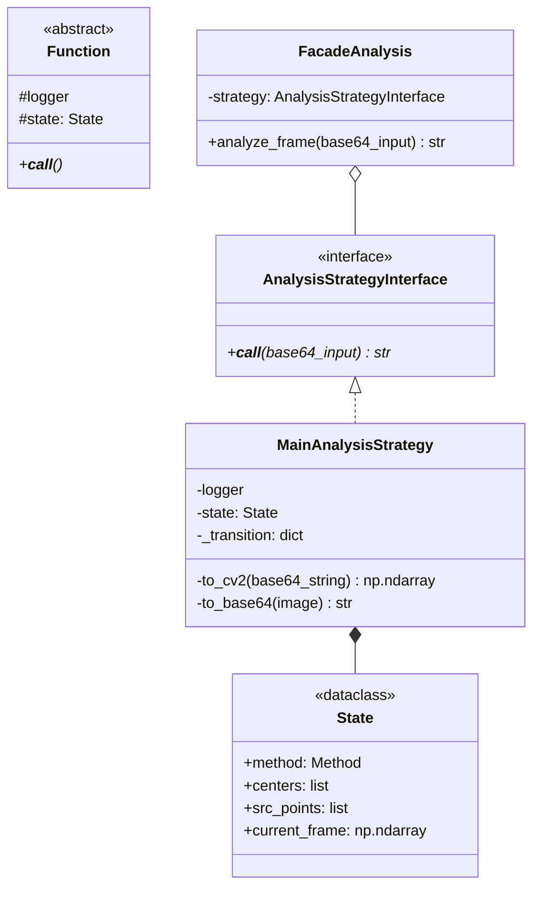

# Sravat

## Системные требования:
- Python 3.8+
- Rust toolchain (для компиляции `scanning_optimized`)
- OpenCV (системная библиотека, опционально)

## Установка Rust (если не установлен):
```bash
# Linux/macOS
curl --proto '=https' --tlsv1.2 -sSf https://sh.rustup.rs | sh

# Windows
# Скачайте и установите с https://rustup.rs/
```

## Как создать и настроить venv:

### Windows:
```bash
# 1. Создание виртуального окружения
python -m venv venv

# 2. Активация
venv\Scripts\activate

# 3. Обновление pip и установка build tools
python -m pip install --upgrade pip
pip install wheel setuptools

# 4. Установка Maturin (для сборки Rust-модулей)
pip install maturin

# 5. Сборка и установка scanning_optimized (если есть локальная папка с Rust-кодом)
# Перейдите в папку с Rust-модулем и выполните:
maturin develop --release

# 6. Установка остальных зависимостей
pip install -r requirements.txt
```

## Альтернативный вариант (без локальной сборки):

Если `scanning_optimized` уже опубликован на PyPI или доступен через GitHub releases:
```bash
pip install -r requirements.txt
```

## Как использовать requirements.txt:
1. `pip install -r requirements.txt` - загружает все модули из файла
2. `pip freeze > requirements.txt` - дозапись еще не записанных модулей

## Структура проекта:
```
Sravat/
├── analysis/           # Python код анализа
├── scanning_optimized/ # Rust модуль (если есть локально)
│   ├── src/
│   │   └── lib.rs
│   ├── Cargo.toml
│   └── pyproject.toml
├── venv/              # Виртуальное окружение (не коммитить!)
├── requirements.txt
└── README.md
```


```