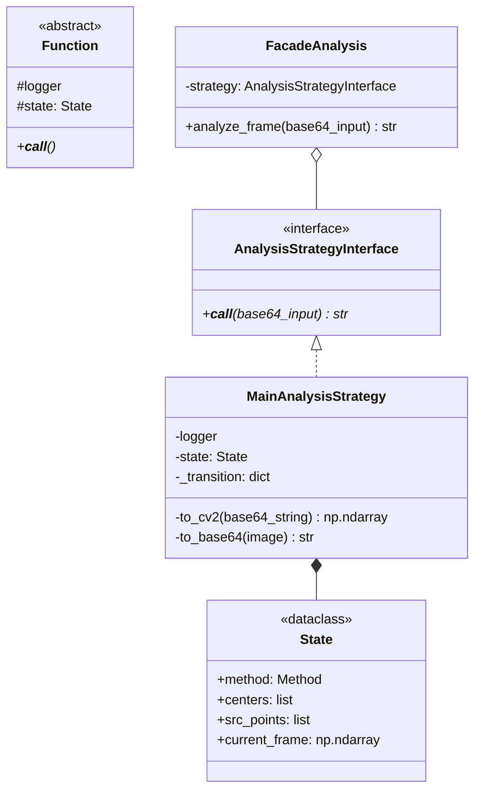

# Sravat

## Что реализовано:
- **Задача 1**
  - Четыре маркера для указания всех сторон
  - ArUco
  - С учетом **ТОЛЬКО** наклона
- **Задача 2**
    - Любой объект внутри поля **БЕЗ ДЫРОК**
    - Алгоритмом компьютерного зрения
- **Задача 3**
  - ArUco
  - Направленный свет (учет поворота маркера относительно угла камеры)
- **Задача 4**
  - Собственный алгоритм
  - Учет перемещения камеры/источника света и оптимальный отклик
  - 
## Алгоритм:
1. Ищутся ровно 4 DICT_6X6_250 маркера, 3d координаты которых ищутся алгоритмом PnP
2. Внутри полученного четырехугольника ищется контур, больше определенной площади и достаточно удаленный от сторон
3. Определяется нижняя точка и от ее положения в четырехугольнике и предположения, что она лежит в его плоскости, находится ее 3d координата
4. По нижней точке и нормали контура ([0 0 -1] - параллельно камере) находятся остальные 3d координаты
5. Собирается список из контуров и диагоналей четырехугольников
6. Все контуры переходят в систему координат диагоналей
   - Главная диагональ та, что в первом кадре была br <- tl
   - Единичный отрезок по модулю равен главной диагонали
   - X сонаправлен с главной диагональю
   - Z cонаправлен с векторным произведением главной и побочной диагональю
   - Y направление такое, что тройка правая
7. Считается матрица поворота, которая делает плоскость контура параллельной X0Y
8. Создается набор точек, расположенных по сетке, образующих параллелепипед и вмещающий в себя все контуры
9. Для каждого контура отдельно
   - Набор точек и контур поворачиваются с помощью найденной матрици поворота
   - Игнорируя Z координату смотрим, включает ли контур точку. Если да, то вместо точки возвращается 0, иначе 1
10. Полученные списки складываются. Все точки, значение которых больше порога отбрасываются
11. Каждая из полученных точек соответствует центру вокселя, которые объединяются в единый mesh
12. На следующих кадрах мы из координат диагоналей и данного 3d объекта вычисляется тень

## Управление:
- q - закрыть программу
- r - заново запустить создание модели
- с - заново откалибровать камеру


## Зачем Rust
Для быстрой многопоточной проверки на нахождение точек (их может быть порядка 10**6) в контуре. Аналогично для объединение вокселей в один mesh. Поэтому создана библиотека из 3-х функций на Rust(2 по созданию mesh, так как нормали не нужны для тени, но нужны для создания obj файла)

## Установка Rust:
```bash
# Linux/macOS
curl --proto '=https' --tlsv1.2 -sSf https://sh.rustup.rs | sh

# Windows
# Скачайте и установите с https://rustup.rs/
```

### Windows:
```bash
# 1. Создание виртуального окружения
python -m venv venv

# 2. Активация
venv\Scripts\activate

# 3. Обновление pip и установка build tools
python -m pip install --upgrade pip
pip install wheel setuptools

# 4. Установка Maturin (для сборки Rust-модулей)
pip install maturin

# 5. Сборка и установка scanning_optimized (если есть локальная папка с Rust-кодом)
# Перейдите в папку с Rust-модулем и выполните:
maturin develop --release

# 6. Установка остальных зависимостей
pip install -r requirements.txt
```

## Структура проекта:
```
Sravat/
├── analysis/           # Python код анализа
├── scanning_optimized/ # Rust модуль (если есть локально)
│   ├── src/
│   │   └── lib.rs
│   ├── Cargo.toml
│   └── pyproject.toml
├── venv/              # Виртуальное окружение (не коммитить!)
├── requirements.txt
└── README.md
```


```