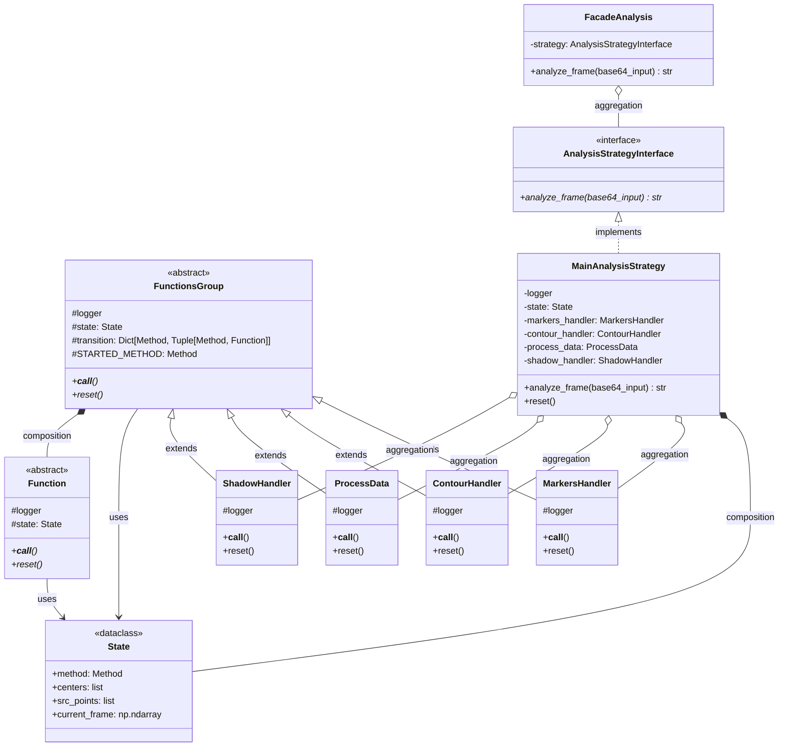

# Sravat

## Запуск:
файл запуска analysis\run.py
Для запуска необходимо сначала в терминале выполнить следующие команды:

### Windows:
```bash
python -m venv venv

venv\Scripts\activate

pip install maturin

maturin develop --release

pip install -r requirements.txt
```

## Что реализовано:
- **Задача 1**
  - Четыре маркера для указания всех сторон
  - ArUco
  - С учетом **ТОЛЬКО** наклона
- **Задача 2**
    - Любой объект внутри поля **БЕЗ ДЫРОК**
    - Алгоритмом компьютерного зрения
- **Задача 3**
  - ArUco
  - Направленный свет (учет поворота маркера относительно угла камеры)
- **Задача 4**
  - Собственный алгоритм
  - Учет перемещения камеры/источника света и оптимальный отклик
  - 
## Алгоритм:
1. Ищутся ровно 4 DICT_6X6_250 маркера, 3d координаты которых ищутся алгоритмом PnP
2. Внутри полученного четырехугольника ищется контур, больше определенной площади и достаточно удаленный от сторон
3. Определяется нижняя точка и от ее положения в четырехугольнике и предположения, что она лежит в его плоскости, находится ее 3d координата
4. По нижней точке и нормали контура ([0 0 -1] - параллельно камере) находятся остальные 3d координаты
5. Собирается список из контуров и диагоналей четырехугольников
6. Все контуры переходят в систему координат диагоналей
   - Главная диагональ та, что в первом кадре была br <- tl
   - Единичный отрезок по модулю равен главной диагонали
   - X сонаправлен с главной диагональю
   - Z cонаправлен с векторным произведением главной и побочной диагональю
   - Y направление такое, что тройка правая
7. Считается матрица поворота, которая делает плоскость контура параллельной X0Y
8. Создается набор точек, расположенных по сетке, образующих параллелепипед и вмещающий в себя все контуры
9. Для каждого контура отдельно
   - Набор точек и контур поворачиваются с помощью найденной матрици поворота
   - Игнорируя Z координату смотрим, включает ли контур точку. Если да, то вместо точки возвращается 0, иначе 1
10. Полученные списки складываются. Все точки, значение которых больше порога отбрасываются
11. Каждая из полученных точек соответствует центру вокселя, которые объединяются в единый mesh
12. На следующих кадрах мы из координат диагоналей и данного 3d объекта вычисляется тень

## Управление:
- q - закрыть программу
- r - заново запустить создание модели
- с - заново откалибровать камеру


## Зачем Rust
Для быстрой многопоточной проверки на нахождение точек (их может быть порядка 10**6) в контуре. Аналогично для объединение вокселей в один mesh. Поэтому создана библиотека из 3-х функций на Rust(2 по созданию mesh, так как нормали не нужны для тени, но нужны для создания obj файла)

## Установка Rust:
```bash
# Linux/macOS
curl --proto '=https' --tlsv1.2 -sSf https://sh.rustup.rs | sh

# Windows
# Скачайте и установите с https://rustup.rs/
```

## Файлы проекта:
- analysis - python код
- rust_part - код библиотеки на rust
- markers - картинки маркеров, которые использовались для тестировки
- sandbox - тесты и файлы, не вошедшие в проект

## analysis
- analysis_config.py - загружает конфиги из файлов
- analysis_state.py - хранит переменные, обновляющиеся каждый кадр, которые обрабатывают функции
- facade_analysis.py - ограничивает взаимодействие с системой обработки и меняет текущие стратегии обработки
- logger_config.py - настройка логирования
- run.py - запускает фасад. Главный файл проекта
- strategy
  - стратегии, которые обрабатывают изображения
  - camera_calibration_strategy.py - стратегия получения калибровки камеры. Реализация находится в ней же
  - main_strategy.py - стратегия обработки изображения с целью получить контура. Управляет обработчиками (группами функций)
- functions_group
    - обработчик или группа функций. Управляет функциями, которые хранят конкретную реализацию обработки
    - contour_handler.py - ищет и обрабатывает контур
    - markers_handler.py - ищет и обрабатывает маркеры четырех угольника
    - process_data.py - обрабатывает данные и делает из них 3d модель
    - shadow_handler.py - создает тень
- functions - конкретная реализация каждой из функций. С точки зрения python функция - это класс с call, и используются они, как функция, поэтому они называются функциями. У всех них есть собственный logger для понимания, откуда пришел лог и доступ к state

## MainStrategy
Каждый из обработчиков является машиной состояний. У них есть начальное состояние и переходы между ними, причем каждому состоянию соответствует функция(за исключением состояния EXIT, которое соответствует выходу из обработчика). Так же каждая функция обернута в декоратор handle_exceptions, который выводит в лог ошибку и меняет состояние на ERROR, которое так же приведет к выходу из обработчика. После каждого вызова обработчика MAinStrategy проверяет текущее состояние на равенство ERROR, и если оно случилось, то сразу возвращает кадр без изменений, не вызывая последующие обработчики. Если же все обработчики успешно вызвались, то просто вернет текущий кадр 

